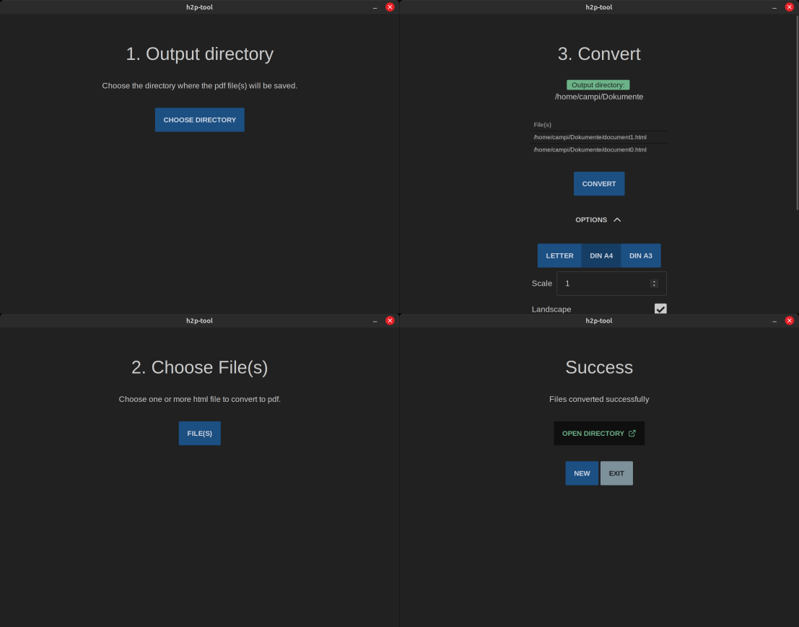

# 🖨 HTML to PDF Converter

A desktop app for converting html files to pdf. It can handle multiple files and has options for the converted output.



## 🔥 Features

- 💻 Convert html files to pdf
- 📚 Convert multiple files at once
- 📥 Set output directory
- 📄 Set page size
- ⤵️ Set page orientation
- 🔁 Set page margins

## 🎮 How to use

> **Note:** Installed _Chrome_ browser is required for the app to work.

1. Download the latest release from [here](https://github.com/camperking/h2p-tool/releases) and install it.
2. Open the app and set the output directory.
3. Select the files you want to convert and choose options for the output.
4. Click on the convert button and wait for the process to finish.

## 🛠 Development

1. Clone the repo
2. Install dependencies

```bash
npm install
```

3. Run the app

```bash
npm run tauri dev
```

## 🎉 Credits

- [Tauri](https://tauri.app/)
- [Svelte](https://svelte.dev/)

## 💡 License

[MIT](./LICENSE)